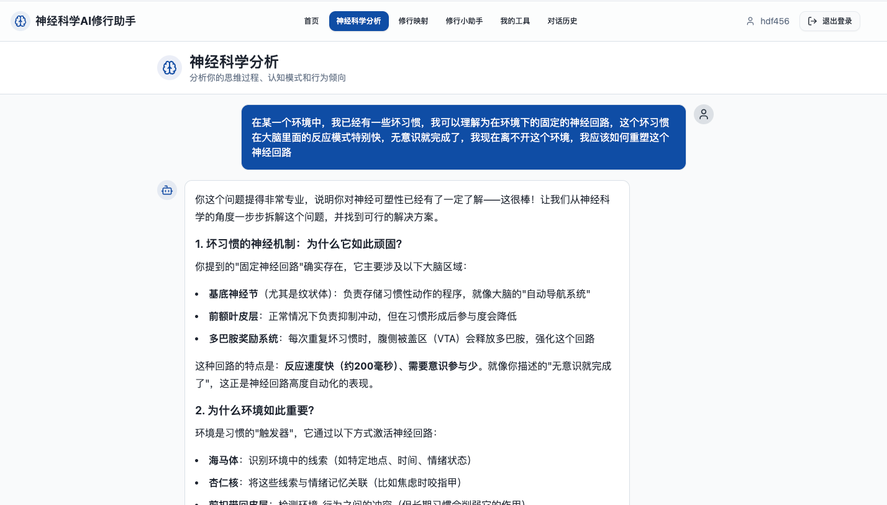
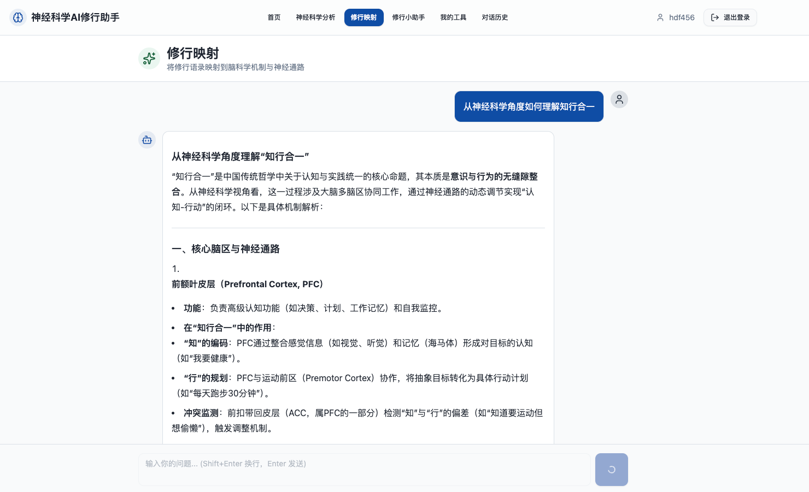

# NSPAS - 神经科学修行助手

## 项目简介

NSPAS (Neuroscience Practice Assistant System) 是一个结合神经科学与修行实践的智能助手系统，旨在帮助用户通过科学方法理解和提升修行体验。

### 主要功能
- **神经科学分析**：
  - 分析用户的语言和思维过程，判断有哪些大脑区域或神经回路在运作，做实时神经机制解读
  - 分析和判断用户的行为，触发大脑哪些机制与神经回路
  
- **修行映射**：
  - 从神经回路、脑科学角度解释用户目前面临的困境和思维反应，帮助用户理解自己的大脑
  - 将用户问的修行语录做脑科学与神经回路释义，比如知行合一，无为，无我
  

- **修行助手**：
  - 根据用户需求，想要改变的神经回路，提供神经可塑性训练方法
    - 提供正念、认知重构、神经可塑性训练等修行建议
    - 根据用户的需求生成修行帮助小应用（HTML的动态页面，是个性化实时生成的HTML页面，用户确认之后，保存在用户的空间，用列表显示，点击可以重新加载出来），帮助用户认识和管理自己的思维和神经回路
    示例可以查看：[5分钟神经友好型冥想引导](data/5分钟神经友好型冥想引导.html)

### 技术栈概览
- **后端**：Go语言、Gin框架、mongodb
- **AI服务**：Python、LangChain、LLM
- **前端**：React、TypeScript、Vite
- **数据库**：MongoDB

## 项目结构

```
├── data/               # 示例数据和文档
├── doc/                # 项目文档
├── go-service/         # Go后端服务
│   ├── config/         # 配置文件
│   ├── controllers/    # API控制器
│   ├── database/       # 数据库连接
│   ├── logger/         # 日志系统
│   ├── middleware/     # 中间件
│   ├── models/         # 数据模型
│   ├── script/         # 脚本文件
│   ├── services/       # 业务逻辑
│   ├── .env.example    # 环境变量示例
│   ├── go-service      # 编译产物
│   ├── go.mod          # Go模块文件
│   ├── go.sum          # 依赖校验文件
│   ├── main.go         # 主入口文件
│   └── nspas-go-service # 编译产物
├── images/             # 图片资源
├── python-ai-service/  # Python AI服务
│   ├── agent/          # AI代理
│   ├── chroma_db/      # 向量数据库
│   ├── tests/          # 测试文件
│   ├── .env.example    # 环境变量示例
│   ├── .python-version # Python版本
│   ├── app.py          # 主入口文件
│   ├── pyproject.toml  # Python项目配置
│   ├── requirements.md # 依赖说明
│   ├── setup.py        # 安装脚本
│   └── uv.lock         # 依赖锁定
├── web-frontend/       # 前端应用
│   ├── public/         # 静态资源
│   ├── src/            # 源代码
│   │   ├── components/ # 组件
│   │   ├── context/    # 上下文
│   │   ├── hooks/      # 自定义钩子
│   │   ├── pages/      # 页面
│   │   ├── services/   # 服务
│   │   └── types/      # 类型定义
│   ├── .gitignore      # Git忽略文件
│   ├── README.md       # 前端README
│   ├── eslint.config.js # ESLint配置
│   ├── index.html      # HTML入口
│   ├── package.json    # 包配置
│   ├── tsconfig.app.json # TypeScript配置
│   ├── tsconfig.json   # TypeScript配置
│   ├── tsconfig.node.json # TypeScript配置
│   └── vite.config.ts  # Vite配置
├── .gitignore          # Git忽略文件
├── LICENSE             # 许可证
└── env.example         # 环境变量示例
```

## 系统架构

### 整体架构

NSPAS采用微服务架构，包含三个核心服务：

1. **Go后端服务**：处理用户认证、对话管理和API请求
2. **Python AI服务**：提供AI聊天和神经科学相关功能
3. **前端应用**：提供用户界面和交互

### 核心服务说明

- **Go后端服务**：
  - 提供RESTful API接口
  - 处理用户认证和授权
  - 管理对话数据
  - 与AI服务通信

- **Python AI服务**：
  - 提供三种AI代理：神经科学分析、修行映射、修行助手
  - 处理流式聊天请求
  - 管理AI模型和工具

- **前端应用**：
  - 提供用户界面
  - 处理用户交互
  - 与后端API通信
  - 展示AI响应

### 数据流

1. 用户通过前端发起请求
2. 前端将请求发送到Go后端服务
3. Go后端服务处理认证和授权
4. 对于AI相关请求，Go后端服务将请求转发到Python AI服务
5. Python AI服务处理请求并返回响应
6. Go后端服务将响应返回给前端
7. 前端展示响应给用户

## 主要功能

### 用户认证系统
- **账号注册**：创建新用户账号
- **账号登录**：使用账号密码登录
- **微信登录**：通过微信OAuth登录
- **获取当前用户**：获取已登录用户信息

### 对话管理
- **创建对话**：创建新的对话
- **获取用户对话**：获取用户的所有对话
- **获取对话详情**：获取特定对话的详情
- **更新对话**：更新对话信息
- **删除对话**：删除对话

### AI聊天服务
- **流式聊天**：与AI进行实时流式对话
- **对话历史**：查看和管理对话历史
- **记忆管理**：获取对话记忆

### 神经科学分析
- 分析用户的修行体验
- 提供基于神经科学的见解
- 解释修行现象的神经科学基础

### 修行映射
- 根据用户情况生成个性化修行路径
- 评估用户的修行状态
- 提供修行建议和目标

### 修行助手
- 提供修行指导和建议
- 回答修行相关问题
- 支持用户的修行实践

## 技术栈

### 后端技术
- **语言**：Go 1.20+
- **框架**：Gin
- **数据库**：MongoDB
- **认证**：JWT、OAuth2
- **日志**：slog

### AI服务技术
- **语言**：Python 3.10+
- **框架**：FastAPI、LangChain
- **向量数据库**：ChromaDB
- **LLM**：大语言模型

### 前端技术
- **框架**：React 18+
- **语言**：TypeScript
- **构建工具**：Vite
- **路由**：React Router
- **状态管理**：Context API

### 数据库
- **主数据库**：MongoDB
- **向量数据库**：ChromaDB

## 快速开始

### 环境要求

- **Go**：1.20+
- **Python**：3.10+
- **Node.js**：18+
- **MongoDB**：4.0+

### 安装步骤

#### 1. 克隆项目

```bash
git clone <repository-url>
cd nspas
```

#### 2. 配置环境变量

复制环境变量示例文件并填写相应值：

```bash
# 后端服务
cp go-service/.env.example go-service/.env

# AI服务
cp python-ai-service/.env.example python-ai-service/.env

# 前端
cp env.example .env
```

#### 3. 启动服务

##### 启动后端服务

```bash
cd go-service
go build
go run main.go
```

##### 启动AI服务

```bash
cd python-ai-service
pip install -r requirements.txt
python app.py
```

##### 启动前端服务

```bash
cd web-frontend
npm install
npm run dev
```

### 配置说明

#### 后端配置

- `SERVER_PORT`：后端服务端口
- `DATABASE_URL`：MongoDB连接URL
- `DATABASE_NAME`：数据库名称
- `JWT_SECRET`：JWT密钥
- `WECHAT_APP_ID`：微信应用ID
- `WECHAT_APP_SECRET`：微信应用密钥

#### AI服务配置

- `LLM_API_KEY`：LLM API密钥
- `LLM_MODEL`：LLM模型名称
- `CHROMA_DB_PATH`：ChromaDB路径

#### 前端配置

- `VITE_API_URL`：后端API地址
- `VITE_AI_SERVICE_URL`：AI服务地址

